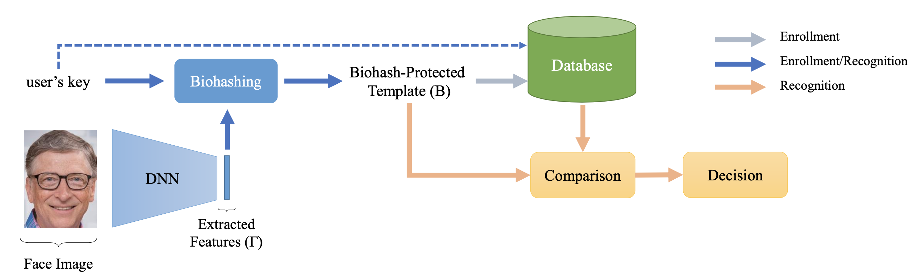

.. @author: Hatef OTROSHI <hatef.otroshi@idiap.ch>

============================================================================================================
 On the Recognition Performance of BioHashing on state-of-the-art Face Recognition models
============================================================================================================

   Block diagram of a Biohash-protected Face Recognition system.

This package is part of the signal-processing and machine learning toolbox Bob_. 
It contains the source code to reproduce the following paper::

      @inproceedings{wifs2021_biohashing_sota_face,
         title={On the Recognition Performance of BioHashing on state-of-the-art Face Recognition models},
         author={Shahreza, Hatef Otroshi and Hahn, Vedrana Krivoku{\'c}a and Marcel, S{\'e}bastien},
         booktitle={2021 IEEE International Workshop on Information Forensics and Security (WIFS)},
         pages={1--6},
         year={2021},
         organization={IEEE}
      }

Installation
------------
The installation instructions are based on conda_ and works on **Linux systems
only**. Therefore, please `install conda`_ before continuing.

For installation, please download the source code of this paper and unpack it. Then, you can create a conda
environment with the following command::

    $ cd bob.paper.wifs2021_biohashing_sota_face

    # create the environment
    $ conda create --name bob.paper.wifs2021_biohashing_sota_face --file package-list.txt

    $ conda activate bob.paper.wifs2021_biohashing_sota_face  # activate the environment
    $ buildout

    $ export wifs2021_biohashing_sota_face_path=$(pwd) 

Downloading the datasets
------------------------

Two datasets are used in this study which are publicly available.
To download the datasets please refer to their websites:

* `MOBIO`_
* `LFW`_

Configuring the directories of the datasets
--------------------------------------------

Now that you have downloaded the four databases. You need to set the paths to
those in the configuration files. Bob_ supports a configuration file
(``~/.bobrc``) in your home directory to specify where the
databases are located. Please specify the paths for the database like below::

    # Setup MOBIO directories
    $ bob config set  bob.db.mobio.directory [YOUR_MOBIO_IMAGE_DIRECTORY]
    $ bob config set  bob.db.mobio.annotation_directory [YOUR_MOBIO_ANNOTATION_DIRECTORY]
   
    # Setup LFW directories
    $ bob config set  bob.db.lfw.directory [YOUR_LFW_IMAGE_DIRECTORY]
    $ bob config set  bob.bio.face.lfw.annotation_directory [YOUR_LFW_ANNOTATION_DIRECTORY]

Running the Experiments
------------------------
All the pipelines used in this paper are available in the `./experiments <experiments>` directory.
You can run each experiment you want from the mentioned directory. For example, to run the Baseline 
for ArcFace on the LFW dataste, you need to run the following command in the corresponding directory::

    $ cd experiments/LFW/ArcFace/Baseline/
    $
    $ # To run on SGE using Dask
    $ $wifs2021_biohashing_sota_face_path/bin/bob bio pipelines vanilla-biometrics my_pipeline.py -l sge -o results -vvv
    $ # To run locally
    $ $wifs2021_biohashing_sota_face_path/bin/bob bio pipelines vanilla-biometrics my_pipeline.py -l $wifs2021_biohashing_sota_face_path/bob/paper/wifs2021_biohashing_sota_face/local.py -o results -vvv

To run all the experiments, you can use ``run_experiments.sh`` as following::

    $ ./run_experiments.sh

**Note:** In `./run_experiments.sh <run_experiments.sh>`_ file, there is a variable, ``run_on_grid``, to 
execute the task on computaion grid (using dask_). If you have SGE computaion grid, you can set it `True`,
otherwise you need to set it `False` and run the experiments locally.

Generating ROC Plots (Figure 2)
--------------------------------
To generate ROC plts (as in Figure 2 of the paper), you need to go to `./evaluation/ROC <evaluation/ROC>`_ directory 
and run the bash file::

    $ cd evaluation/ROC
    $ ./bash.sh

Generating TMR-L_BioHash Plots (Figure 3)
-------------------------------------------
To generate TMR vs L_BioHash plots (as in Figure 3 of the paper), you can use the notebook which is available in 
`./evaluation/TMR_LBhsh <evaluation/TMR_LBhsh>`_ directory.

Generating Table 1
------------------------
To generate Table 1 of the paper, you can use the same notebook as for Figure 3, which is available in 
`./evaluation/TMR_LBhsh <evaluation/TMR_LBhsh>`_ directory.

Contact
-------

For questions or reporting issues to this software package, contact our
development `mailing list`_.

.. Place your references here:
.. _bob: https://www.idiap.ch/software/bob
.. _dask: https://dask.org/
.. _installation: https://www.idiap.ch/software/bob/install
.. _mailing list: https://www.idiap.ch/software/bob/discuss
.. _conda: https://conda.io
.. _install conda: https://conda.io/docs/install/quick.html#linux-miniconda-install
.. _mobio: https://www.idiap.ch/dataset/mobio
.. _lfw: http://vis-www.cs.umass.edu/lfw/